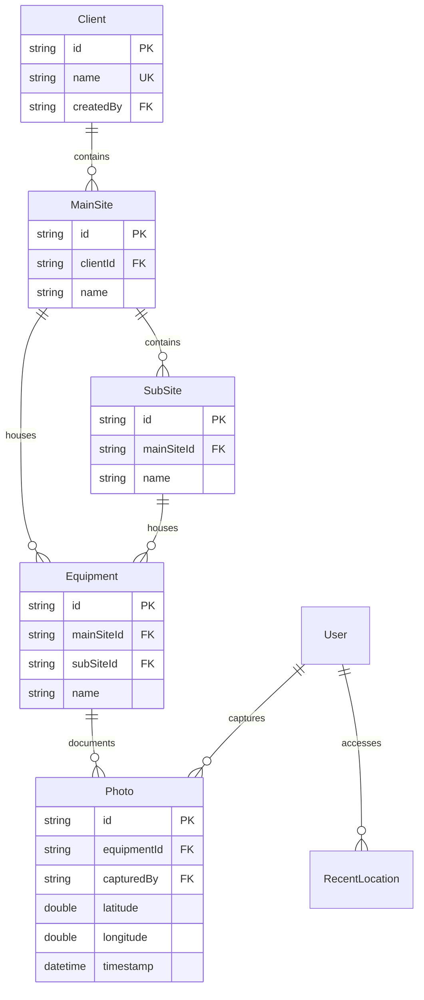

# Data Model

**Feature**: UI/UX Design for Site Pictures Application
**Version**: 1.0.0

## Entity Definitions

### User
```dart
class User {
  String id;           // UUID
  String email;        // Unique
  String name;
  UserRole role;       // enum: ADMIN, TECHNICIAN, VIEWER
  DateTime createdAt;
  DateTime updatedAt;
  String? lastSyncAt; // ISO 8601
}
```

**Constraints**:
- Email must be unique across system
- Role determines access permissions
- Viewers cannot modify data

### Client
```dart
class Client {
  String id;           // UUID
  String name;         // Required, max 100 chars
  String? description; // Optional, max 500 chars
  String createdBy;    // User ID
  DateTime createdAt;
  DateTime updatedAt;
  bool isActive;       // Soft delete flag
}
```

**Constraints**:
- Name required and must be unique per account
- Soft delete via isActive flag
- Cannot delete if has associated sites

### MainSite
```dart
class MainSite {
  String id;           // UUID
  String clientId;     // Foreign key
  String name;         // Required, max 100 chars
  String? address;     // Optional
  double? latitude;    // GPS coordinate
  double? longitude;   // GPS coordinate
  String createdBy;    // User ID
  DateTime createdAt;
  DateTime updatedAt;
  bool isActive;
}
```

**Constraints**:
- Belongs to exactly one Client
- Can contain SubSites and Equipment
- Name unique within Client scope
- GPS coordinates stored but optional

### SubSite
```dart
class SubSite {
  String id;           // UUID
  String mainSiteId;   // Foreign key
  String name;         // Required, max 100 chars
  String? description;
  String createdBy;    // User ID
  DateTime createdAt;
  DateTime updatedAt;
  bool isActive;
}
```

**Constraints**:
- Belongs to exactly one MainSite
- Can only contain Equipment (no further nesting)
- Name unique within MainSite scope

### Equipment
```dart
class Equipment {
  String id;              // UUID
  String? mainSiteId;     // Foreign key (nullable)
  String? subSiteId;      // Foreign key (nullable)
  String name;            // Required, max 100 chars
  String? serialNumber;   // Optional
  String? manufacturer;   // Optional
  String? model;          // Optional
  String createdBy;       // User ID
  DateTime createdAt;
  DateTime updatedAt;
  bool isActive;
}
```

**Constraints**:
- Must belong to either MainSite OR SubSite (XOR)
- Validation: exactly one of mainSiteId or subSiteId must be non-null
- Name unique within parent scope

### Photo
```dart
class Photo {
  String id;              // UUID
  String equipmentId;     // Foreign key (required)
  String filePath;        // Local file system path
  String? thumbnailPath;  // Cached thumbnail path
  double latitude;        // GPS coordinate (required)
  double longitude;       // GPS coordinate (required)
  DateTime timestamp;     // Capture time (required)
  String capturedBy;      // User ID
  int fileSize;          // Bytes
  bool isSynced;         // Sync status
  String? syncedAt;      // ISO 8601
  String? remoteUrl;     // Server URL after sync
}
```

**Constraints**:
- Must be associated with Equipment
- GPS coordinates required (from clarification)
- Timestamp required (from clarification)
- Original file never modified

### RecentLocation
```dart
class RecentLocation {
  String id;              // UUID
  String userId;          // Foreign key
  String? clientId;       // Foreign key
  String? mainSiteId;     // Foreign key
  String? subSiteId;      // Foreign key
  String? equipmentId;    // Foreign key
  DateTime accessedAt;    // Last access time
  String displayName;     // Cached display name
  String navigationPath;  // Cached breadcrumb
}
```

**Constraints**:
- Maximum 10 recent locations per user
- Older entries auto-removed
- At least one location ID must be non-null

### SyncQueue
```dart
class SyncQueueItem {
  String id;              // UUID
  String entityType;      // 'photo', 'client', 'site', etc.
  String entityId;        // ID of entity to sync
  String operation;       // 'create', 'update', 'delete'
  String payload;         // JSON serialized data
  int retryCount;         // Number of attempts
  DateTime createdAt;     // Queue time
  DateTime? lastAttempt;  // Last sync attempt
  String? error;          // Last error message
  bool isCompleted;       // Success flag
}
```

**Constraints**:
- Items processed in FIFO order per entity type
- Max 3 retry attempts with exponential backoff
- Completed items purged after 7 days

## Relationships



## State Transitions

### Photo Lifecycle
```
Created (local) → Queued → Syncing → Synced
                    ↓         ↓
                  Failed ← Retry
```

### Sync Queue States
```
Pending → Processing → Completed
            ↓      ↑
          Failed → Retrying
```

## Validation Rules

### Client
- Name: Required, 1-100 characters, alphanumeric + spaces
- Cannot delete if has active MainSites

### Sites (Main/Sub)
- Name: Required, 1-100 characters
- GPS coordinates: Valid latitude (-90 to 90), longitude (-180 to 180)
- SubSite cannot exist without MainSite

### Equipment
- Name: Required, 1-100 characters
- Must have exactly one parent (MainSite XOR SubSite)
- Serial number: Optional, alphanumeric if provided

### Photo
- File must exist at filePath
- GPS coordinates required and valid
- Timestamp cannot be future
- File size > 0 and < 10MB
- Equipment association required

## Database Indexes

### Performance Optimizations
```sql
-- Frequent queries
CREATE INDEX idx_mainsite_client ON main_sites(client_id, is_active);
CREATE INDEX idx_subsite_mainsite ON sub_sites(main_site_id, is_active);
CREATE INDEX idx_equipment_mainsite ON equipment(main_site_id, is_active);
CREATE INDEX idx_equipment_subsite ON equipment(sub_site_id, is_active);
CREATE INDEX idx_photo_equipment ON photos(equipment_id, timestamp DESC);
CREATE INDEX idx_photo_sync ON photos(is_synced, created_at);

-- Recent locations
CREATE INDEX idx_recent_user ON recent_locations(user_id, accessed_at DESC);

-- Sync queue
CREATE INDEX idx_sync_pending ON sync_queue(is_completed, created_at);
```

## Storage Calculations

### Estimates per 1000 photos
- Photo files: ~3GB (3MB average)
- Thumbnails: ~100MB (100KB each)
- Metadata: ~1MB (1KB per record)
- Total: ~3.1GB storage

### Database size projections
- 100 clients: ~10KB
- 1000 sites: ~200KB
- 5000 equipment: ~500KB
- 10000 photos metadata: ~10MB
- Total DB: < 50MB for typical deployment

## Migration Strategy

### Initial Schema (v1.0.0)
All tables created with version 1 schema as defined above.

### Future Considerations
- Add equipment maintenance history
- Support for video capture
- Multi-language descriptions
- Custom fields per client
- Audit log for all changes